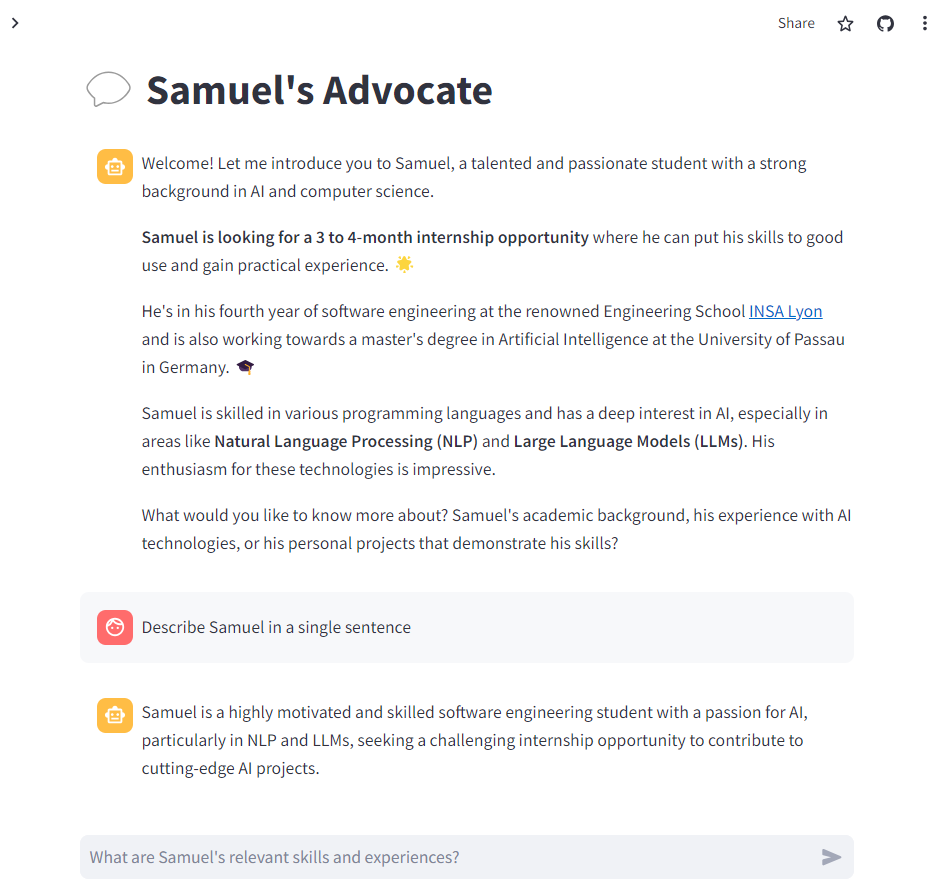

# Samuel Internship Advocate

An AI-powered assistant designed to advocate for me in my quest for finding the perfect internship.



# Setup

### Dependencies

```bash
python -m venv venv
source venv/bin/activate
pip install -r requirements.txt
```

### Secrets

Create a `secrets.toml` file in [.streamlit](.streamlit) directory with the following content:

```toml
EDENAI_API_KEY = "<Get your EdenAI API Key here : https://docs.edenai.co/reference/start-your-ai-journey-with-edenai>"
SAMUEL_DETAILS_URL = "<Url where a text file containing the details of the intern is stored>"
```

### Usage

```bash
streamlit run app.py
```
